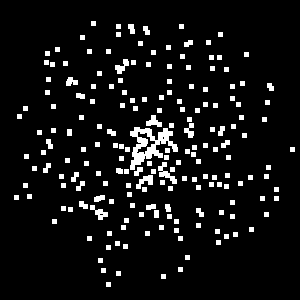

# Physically-Based Rendering

A short course on pathtracing for Stamatics Projects '21.

## Week 5

This week's task moves away from the core renderer.

### Task: Sampling a circle in 2D

Implement the `sample_unit_circle()` function in `tools/sampler/sampler.h`. This function should return `n` points picked randomly from the unit circle. You can use the C++ standard library to generate random numbers.

Here's the challenging part. Try to pick points spread *uniformly* across the circle. In the the naive implementation below, you can see that the center has a higher density of points than the boundary.

### Result

One possible way to sample the unit circle could lead to samples like this. The `build/bin/sampler2d` executable generates this image to `build/bin/`.



## Build Instructions

**Requirements:**
- C++ compiler
- CMake (get this via `pip` and not `apt` if you're on Ubuntu)

**Build:**

```
mkdir build
cd build
cmake ..
cmake --build .
```

You should now have an executable in `build/bin` or `build/bin/Debug`
