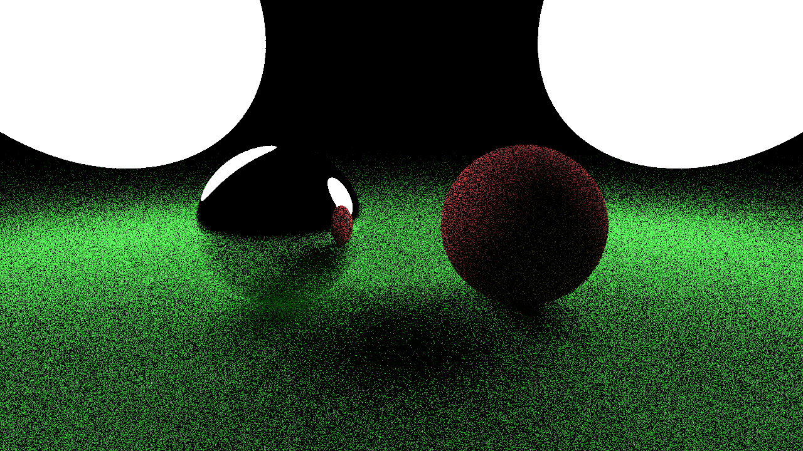
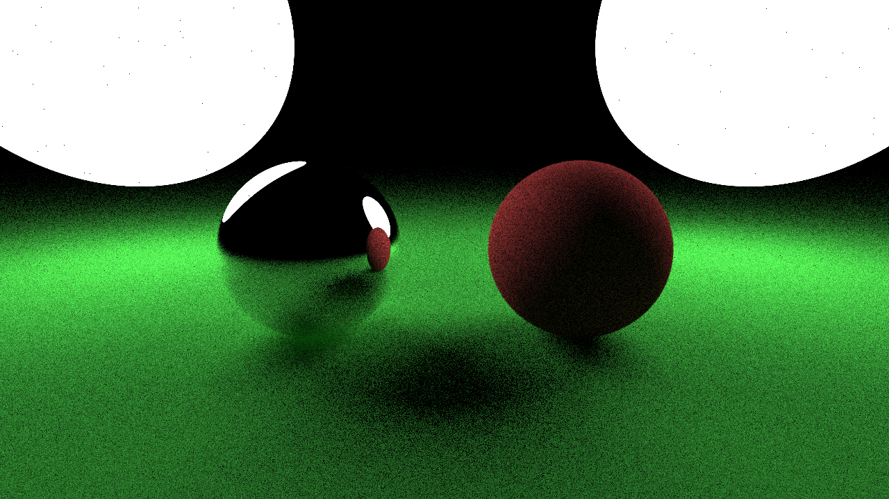
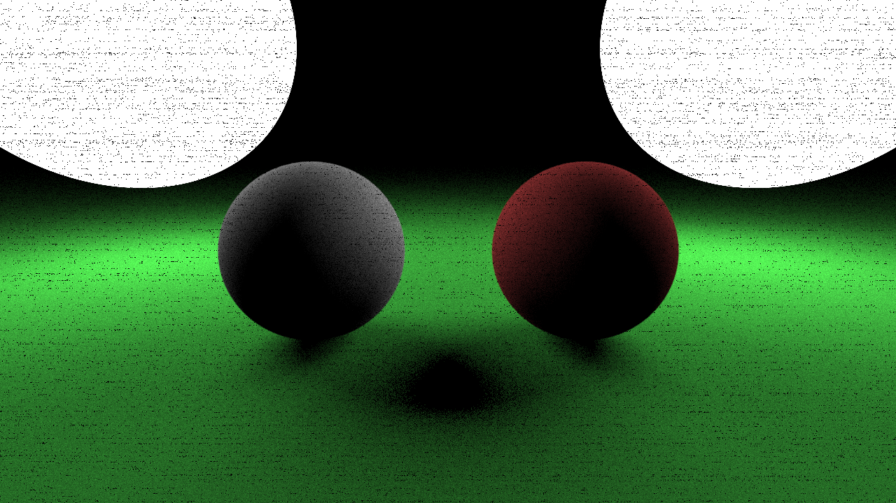

# Physically-Based Rendering

A short course on pathtracing for Stamatics Projects '21.

## Week 7

### Task 1: Iterative path tracing

We saw the new path-based formulation of the integral and the incremental construction of paths. `PathIntegrator::trace_ray()` implements a recursive algorithm for the same. The first task is to convert it to an iterative function.

### Task 2: Stratified sampling for the camera

The current implementation samples camera rays uniformly from a circlular region inside the active pixel. Implement [stratified sampling](https://www.pbr-book.org/3ed-2018/Sampling_and_Reconstruction/Stratified_Sampling) which subdivides this pixel and selects samples uniformly within those subdivisions.

### Result

These images were generated with 4 bounces and samples-per-pixel 16, 128, 512 and 1024 respectively. These results were with no stratified sampling and a recursive tracing function.






## Build Instructions

**Requirements:**
- C++ compiler
- CMake (get this via `pip` and not `apt` if you're on Ubuntu)

**Build:**

```
mkdir build
cd build
cmake ..
cmake --build .
```

You should now have an executable in `build/bin` or `build/bin/Debug`
