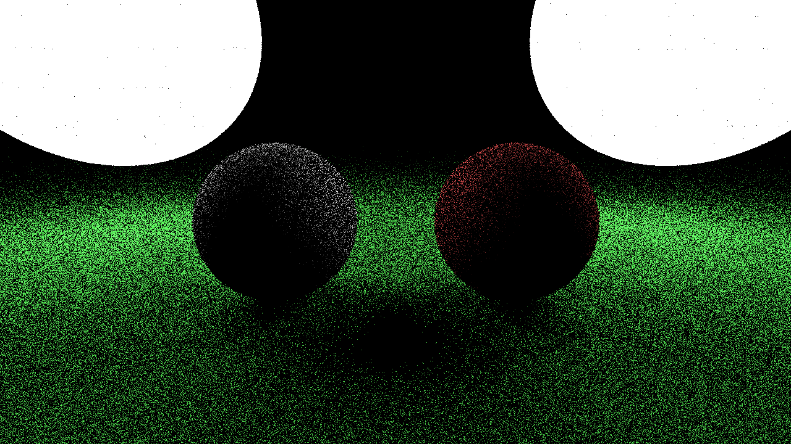

# Physically-Based Rendering

A short course on pathtracing for Stamatics Projects '21.

## Week 7

### Task: Path tracing

This week we'll extend last week's 2D uniform sampler to 3D. Implement the `UniformSampler` to return directions uniformly sampled over a unit sphere.

### Result

These images were generated with the `path::DiffuseBRDF` with samples-per-pixel 8, 128, 512 and 1024 respectively.




## Build Instructions

**Requirements:**
- C++ compiler
- CMake (get this via `pip` and not `apt` if you're on Ubuntu)

**Build:**

```
mkdir build
cd build
cmake ..
cmake --build .
```

You should now have an executable in `build/bin` or `build/bin/Debug`
