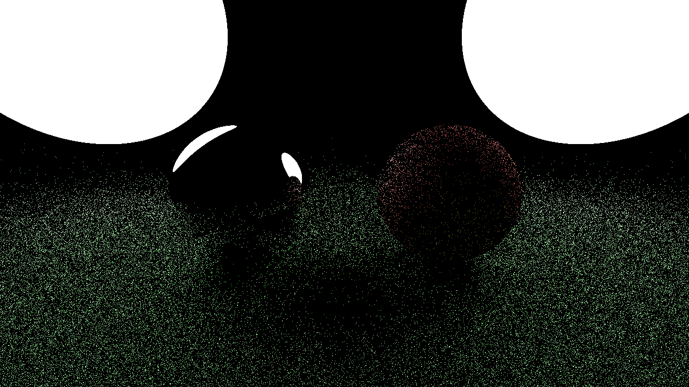

# Physically-Based Rendering

A short course on pathtracing for Stamatics Projects '21

## Week 4

This week we'll implement a popular numerical integration technique.

### Euler's Method

### Result

The first result is with the `DiscreteSampler`, the second one is with the `GridSampler`, but with an 8x8x8 grid and 2 bounces.




## Build Instructions

**Requirements:**
- C++ compiler
- CMake (get this via `pip` and not `apt` if you're on Ubuntu)

**Build:**

```
mkdir build
cd build
cmake ..
cmake --build .
```

You should now have an executable in `build/bin` or `build/bin/Debug`
