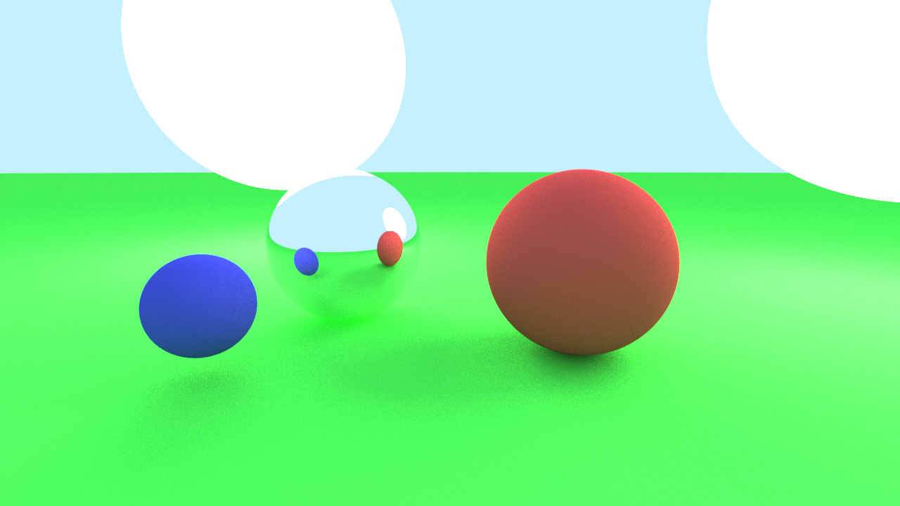
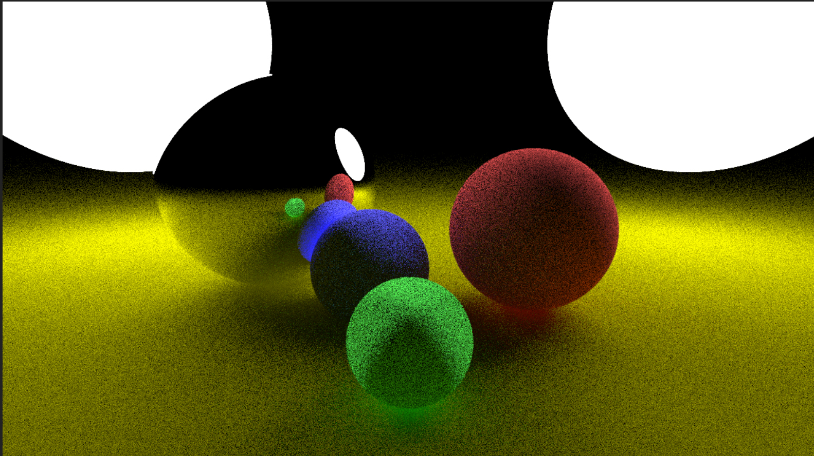
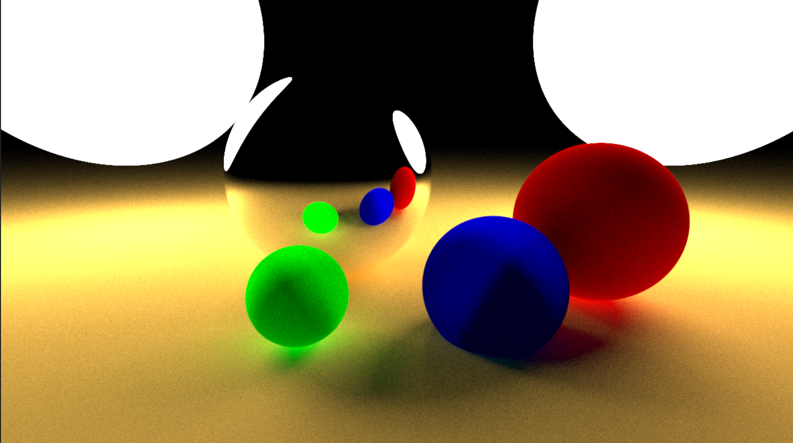
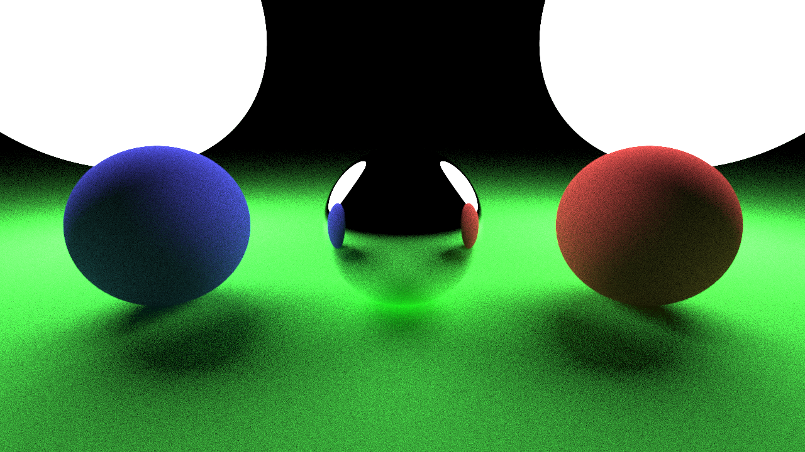

# Physically-Based Rendering

A short course on pathtracing for Stamatics Projects '21.

## Structure

The `week-*` branches have tasks and corresponding code created as part of the eight week course. The `main` branch contains a continuation of that project, extended with various other features and improvements.

## Showcase 

The following are final results by students in the project.

By [@akshatsh49](https://github.com/akshatsh49)


By [@deepalokkaushik](https://github.com/deepalokkaushik)


By [@Prajwal-Arya](https://github.com/Prajwal-Arya)


By [@sps1112](https://github.com/sps1112)


By [@sumeet13gupta](https://github.com/sumeet13gupta)


## Build Instructions

**Requirements:**
- C++ compiler. The main branch requires C++17 but the weekly tasks are compatible with C++11
- CMake (get this via `pip` and not `apt` if you're on Ubuntu)

**Build:**

```
mkdir build
cd build
cmake ..
cmake --build .
```

You should now have an executable in `build/bin` or `build/bin/Debug`
