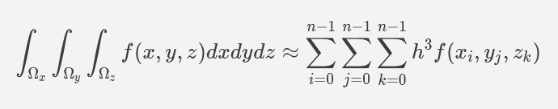
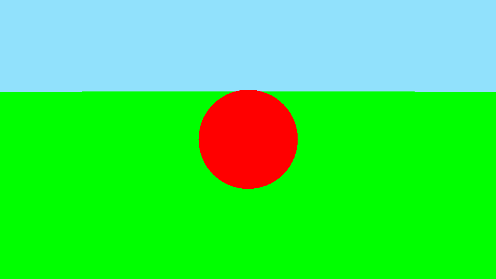
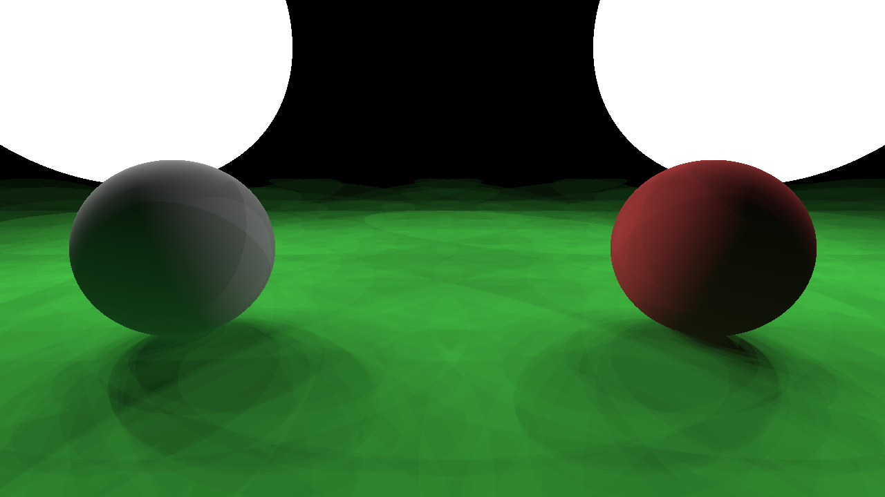

# Physically-Based Rendering

A short course on pathtracing for Stamatics Projects '21

## Week 4

### Task: The `GridSampler`

Remember that with the Forward Euler method we are trying to approximate the integral like this.



The n here is the number of divisions in the grid, given by `PBR_GRID_SAMPLER_SIZE`, and h is the side of a single grid element. The grid is centered at the hit point.

Your task this week is to implement the `GridSampler` class to return an array of rays from the hit point to each element of the nxnxn grid.

### Result

The first result is with the `DiscreteSampler`, the second one is with the `GridSampler` with an 8x8x8 grid. Both have 2 bounces and use the `DiffuseBRDF`.




## Build Instructions

**Requirements:**
- C++ compiler
- CMake (get this via `pip` and not `apt` if you're on Ubuntu)

**Build:**

```
mkdir build
cd build
cmake ..
cmake --build .
```

You should now have an executable in `build/bin` or `build/bin/Debug`
